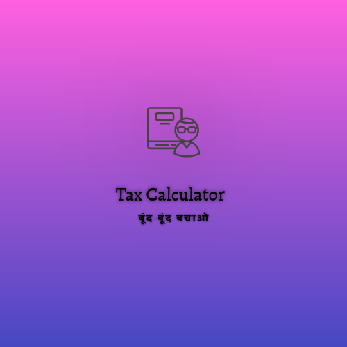

# TaxEase India (Alternative CA) 🇮🇳

> **TaxEase India is a privacy-first, intelligent tax filing assistant & calculator for AY 2026-27 (FY 2025-26). It parses Form 16 & AIS, provides instant Old vs New regime comparison, optimizes deductions (80C, 80D, HRA, NPS), reconciles TDS, and generates ready-to-file ITR-1/ITR-2 schedule summaries with complete data security.**

[](https://ujwal8156v.github.io/Alternative_CA/)
[](LICENSE)



🌐 **Live Application URL:** [https://ujwal8156v.github.io/Alternative_CA/](https://ujwal8156v.github.io/Alternative_CA/)

TaxEase India is a client-side tax computation engine and filing assistant that acts as a digital Chartered Accountant (CA) alternative. It helps salaried individuals, freelancers, and investors optimize deductions, compare Old vs New tax regimes in real time, parse Form 16 / AIS documents, and generate audit-ready ITR-1/ITR-2 schedule summaries.

---

## 🚀 Key Features

- 🔒 **100% Client-Side & Privacy-Preserving:** All computations and document parsing happen locally in your browser. Zero financial data is sent to external servers.
- ⚡ **Form 16 & AIS Ingestion:** Automated parser for Form 16, AIS, and 26AS reports with instant data reconciliation.
- ⚖️ **Old vs. New Tax Regime Optimizer:** Real-time side-by-side tax liability comparison with smart recommendation engine (AY 2026-27 tax slabs & rebates including Section 87A).
- 💡 **Exhaustive Deduction Engine:** Maximize tax savings with 80C, 80D (Health Insurance), 80CCD(1B) (NPS), Section 24(b) (Home Loan Interest), HRA exemption calculator, and Section 80TTA/TTB.
- 📑 **ITR-1 / ITR-2 Schedule Mapper:** Auto-populates filing schedules for Salary, Other Sources, House Property, and Capital Gains ready for the Income Tax e-Filing portal.
- 📱 **Responsive & Modern UI:** Designed with high accessibility, mobile-friendly layouts, and intuitive multi-step wizard workflows.

---

## 🛠️ Tech Stack

- **Frontend:** Vanilla HTML5, JavaScript (ES6+ Modules), Tailwind CSS
- **Design System:** Inter Typography, Material Symbols, Glassmorphic Accent Palette
- **Architecture:** Modular Tax Engine (`taxEngine.js`, `parsers.js`, `validators.js`, `filingGuide.js`)

---

## 📂 Project Structure

```text
├── index.html                   # Main application interface
├── app.js                       # UI controller and wizard orchestrator
├── logo.png                     # Application logo
├── src/
│   ├── taxEngine.js             # Core tax computation & slab calculations (AY 2026-27)
│   ├── parsers.js               # Form 16 / AIS text and JSON parsers
│   ├── validators.js            # Input validations and fiscal sanity checks
│   ├── filingGuide.js           # Step-by-step ITR e-filing guidance
│   ├── presets.js               # Sample profiles & test personas
│   └── testSuite.js             # Built-in tax calculation test cases
└── README.md
```

---

## 🏃 Getting Started

### Prerequisites
Any modern web browser (Chrome, Edge, Firefox, Safari).

### Running Locally
You can run the app with any static file server:

```bash
# Using Python
python -m http.server 8080

# Or using Node npx serve
npx serve .
```

Open [http://localhost:8080](http://localhost:8080) in your browser.

---

## 👤 Author
- **Ujwal Kumar Behera** ([@Ujwal8156v](https://github.com/Ujwal8156v))

---

## ⚖️ License
Distributed under the LGPL / Open Source License. See [LICENSE](LICENSE) for more details.

---

© 2026 Alternative_CA

